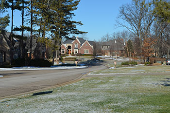

#DGMD-E-27-Spring2016-P1

This is the first assignment for DGMD E-27.

#Source Code

The code consists of the following files:

##Source HTML/php:
**index.php** - This is the landing page for the site. It consists of a header at the top with an image the is swapped using media queries. There is also a main section that has some text describing the site and neighborhood as well as some responsive images that use picturefill.js. There is also a sidebar that incorporates a weather widget using the openweather API.

**photogallery.php** - This is a page for showing various neighborhood photo albums which could be accessed by clicking on the image. The images currently do not link anywhere but could later. There is no weather sidebar on this page but this page incorporates the equal heights javascript code from Ben Howdle (http://benhowdle.im/easy-peasy-equal-heights.html).

**contact.php/login.php/register.php** - These are all form based php files with the weather widget side bar on the right side.

##CSS Source Files:
**normalize.css** - The stylesheet that normalizes everything between browsers.<br>
**styles.css** - The main overall stylesheet for the site. This has media queries in it.<br>
**weather-style.css** - Weather widget sidebar specific stylings.<br>
**formstyle.css** - Form specific stylesheet.<br>

##JS Source Files:
**eqheight.js** - Javascript code from Ben Howdle that makes columns the same heights.<br>
**menu.js** - jQuery code snippet that toggles classes to make a mobile responsive menu. It uses a "hamburger button" in the mobile portrait mode.<br>
**openWeather.js** - jQuery code snippet from Michael Lynch (http://michaelynch.com) distributed under MIT license to access the OpenWeather API.<br>

# Assignment Specific Topics

## Grid System
The grid system uses four (4) columns and the CSS layout (styles.css) is shown below...

```
/* grid system */

.row::after {
    content:"";
    display: table;
    clear:both;
} 

[class*='col-'] {
	float: left;
	min-height: 1px;
}
.col-1 {
	width: 25%;
}
.col-1-2-4 {
	width: 25%;
}
.col-2 {
	width: 50%;
}
.col-3 {
	width: 75%;
}
.col-4 {
	width: 100%;
}
```

.col-1-2-4 goes to 50% width in mobile phone landscape screen sizes and 100% in mobile phone portrait (as do all the columns).

##Used Typefaces
This code uses two google typefaces, Lato (for the general paragraph text) and Francois One (for the heading text)...<br>
```
<link href='https://fonts.googleapis.com/css?family=Francois+One' rel='stylesheet' type='text/css'>
<link href='http://fonts.googleapis.com/css?family=Lato&subset=latin,latin-ext' rel='stylesheet' type='text/css'>
```	
## Responsive Images

Responsive images are handled two ways...
1.) Swapping background images based using media queries
2.) Using Picturefill.js

### Swapping the background header image using media queries

The header background image changes based on screen width. There are four (4) different background images for the header depending on the screen width. The header image is in all the pages for the site... The source html and css code is shown below...

####HTML
```
		<div class="row">
			<header class="col-4">
			</header>
		</div>
```

####CSS (styles.css)
```
@media only screen and (min-width: 1050px) {
	header {
		background: url(../images/sog-entrance-1200.jpg) no-repeat;
		width: 1200px;
		height: 300px;
		font-family: 'Lato', sans-serif; 
		color: #fff;
	}
	...
}

@media only screen and (min-width: 768px) and (max-width: 1049px) {
	header {
		background: url(../images/sog-entrance-1000.jpg) no-repeat;
		width: 1000px;
		height: 300px;
		font-family: 'Lato', sans-serif; 
		color: #fff;
	}
	...
}

@media only screen and 
	(min-width: 480px) and (max-width: 767px)  {

	header {
		background: url(../images/sog-entrance-800.jpg) no-repeat;
		width: 800px;
		height: 300px;
		font-family: 'Lato', sans-serif; 
		color: #fff;
	}
	...
}

@media only screen and (max-width: 479px)  {

	header {
		background: url(../images/sog-entrance-500.jpg) no-repeat;
		width: 500px;
		height: 255px;
		font-family: 'Lato', sans-serif; 
		color: #fff;
	}
	...
}
```
### Swapping images using Picturefill.js
Images in the main section of index.php are swapped based on screen width using picturefill. The source HTML code is shown below.

```
		<!-- Using picturefill, load different pictures depending on the width of the screen
		This picture is in the upper left hand corner of the main section under the <h2> title... -->
		<picture class="first_main_pic">
			<!--[if IE 9]><video style="display: none;"><![endif]-->
			<source srcset="images/sog-entrance-drive-orig-350.jpg" media="(min-width: 1050px)">
			<source srcset="images/sog-entrance-drive-orig-250.jpg" media="(min-width: 768px) and (max-width: 1049px) ">
			<source srcset="images/sog-entrance-drive-orig-200.jpg" media="(min-width: 480px) and (max-width: 767px) ">
			<!--[if IE 9]></video><![endif]-->
			
		</picture>
```

and

```
		<!-- Using picturefill, load different pictures depending on the width of the screen
		This picture is in the lower right hand corner of the main section -->
		<picture class="second_main_pic">
			<!--[if IE 9]><video style="display: none;"><![endif]-->
			<source srcset="images/sog-entrance-sign-250.jpg" media="(min-width: 1050px)">
			<source srcset="images/sog-entrance-sign-200.jpg" media="(min-width: 768px) and (max-width: 1049px) ">
			<source srcset="images/sog-entrance-sign-150.jpg" media="(min-width: 480px) and (max-width: 767px) ">
			<!--[if IE 9]></video><![endif]-->
			
		</picture>
```
